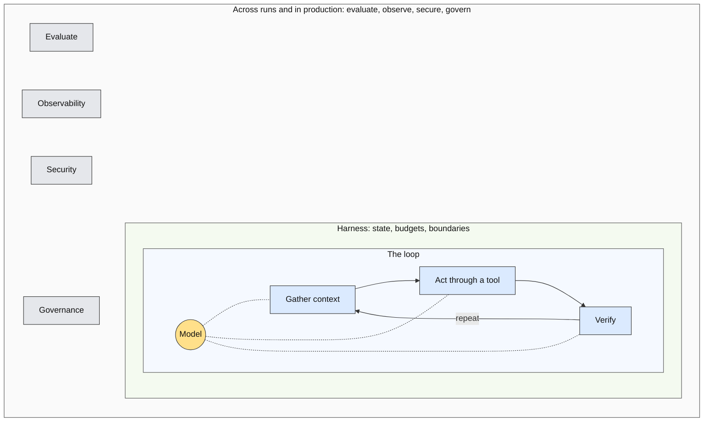

# Beyond the Coding Agent: Talk Overview

A one-file breakdown of the talk as drafted. Compiled 2026-09-13 from `slides/`, `outlines/outline-v4.md`, `research/synthesis.md`, and `style/design-brief.md`. Read this first; open the slide files for the verbatim scripts and sources lines.

## At a glance

| | |
|---|---|
| Title | Beyond the Coding Agent: From Software Engineer to AI Engineer |
| Format | 50 minutes. About 30 of presentation, 20 of questions. |
| Deck | 19 slides, one idea each, numbered globally across five section files |
| Script | About 4,600 words of verbatim first-person script at 150 words per minute |
| Audience | Software engineers, leaning beginner. Most have used a coding agent. Fewer have called a model API. Few have shipped an AI-dependent system. |
| Venue | An internal virtual conference themed "Code Meets Intelligence," delivered over a video call, September 2026 |
| Status | Slides drafted and reviewed with the speaker on 2026-09-12 and 2026-09-13. Section 2 restructured on 2026-09-13 (outline v3), then the running example replaced by the coding agent as the specimen the same day (outline v4). Deck regenerated from the v4 slides. |

## Central thesis

Using AI makes you an AI-enabled software engineer. Engineering systems whose behavior depends on AI makes you an AI engineer.

Slide 1 puts it on screen in two lines and leaves it there. Slide 19 repeats it verbatim, so the wording is fixed.

## The argument

The talk opens on something everyone in the room did this week: shipped code from a coding agent without reading all of it. That is a real skill, but it is AI-enabled software engineering. AI engineering begins when the shipped system itself calls a model at runtime and inherits non-determinism, evaluation, cost, and safety as engineering problems. The middle of the talk is a conceptual map of that discipline, drawn on the agent loop and taught by taking apart the one agent everyone in the room has used, from the builder's side. The end is a transition roadmap concrete enough to act on Monday. The close returns to where it started: the coding agent is this machine, someone engineered every part of it, and the audience has now seen every part from the inside.

Three through-lines make it one argument rather than a list.

1. **The loop.** An agent is a model in a loop: gather context, act through a tool, verify, repeat, inside a harness that owns state, budgets, and boundaries. The loop is the idea; the harness is the program that runs it. Every area of the discipline is a part of that loop. The map in section 2 is drawn on it, and slide 10 shows the loop once as ten lines of code.
2. **The specimen.** The coding agent, dissected one part per area: the model picker (slide 6), the window and the re-read rule (7), the six tools and the permission system (8), the tests before done (9), the progress file and the session boundary (10), the eval set from the repo's history (11), the session trace (12), the injected pull request and the token it pushes with (13). Nothing about it is invented; every beat describes a shipping system or a published incident. On stage it is "your coding agent."
3. **Same machine, different customer.** Each area closes on where a non-coding agent differs. Three carry a sourced story: Amazon's stale wiki (7), NurtureBoss (11), and Cursor's support bot with EchoLeak and ForcedLeak (12 and 13). The rest close on one line. The enterprise agent is the same machine with someone else's data, someone else's credentials, and a compliance officer.

The framing rule behind all three: the audience must never hear that AI engineering means building coding agents, or that configuring a coding agent is engineering one. Every example looks at the machine from the builder's side, and every area ends on the customer changing.

The bridges between sections, in the speaker's words:

| From | To | Line |
|---|---|---|
| 1 | 2 | "This talk is about crossing to that side. We are going to take that agent apart." |
| 4 | 5 | "That fourth stop is the machine we take apart for the next nineteen minutes." |
| 13 | 14 | "Now imagine it holding your customers' data." |
| 14 | 15 | "Now, how do you get there from here?" |
| 18 | 19 | "Which is what the first project is for." |
| 19 | Q&A | "The coding agent you used this morning is this machine. Someone engineered every part of it. Go build one where the customer is on the other end." Then "Questions." |

## Time budget

| Section | Minutes | Slides | Goal |
|---|---|---|---|
| 0. Cold open | 1:00 | 1 | Open on the coding agent, not on AI. Put the thesis on screen and leave it there. |
| 1. The line | 3:45 | 2 to 4 | Define the discipline, explain why it is distinct, set up the spectrum the specimen sits at the end of. |
| 2. Anatomy of an agent | 19:15 | 5 to 14 | The map, drawn on the loop, taught by taking the coding agent apart. The section attendees should photograph. |
| 3. Making the transition | 5:00 | 15 to 18 | What carries over, what to add, the mistakes to skip, the first project, where to learn. |
| 4. Close | 1:00 | 19 | The map once more, the thesis in the same words as slide 1, the closing line, questions. |
| Questions and discussion | 20:00 | | Sixteen anticipated questions with twenty-second stage answers in `slides/qa.md`. |

The per-slide times in the section files sum to exactly 30:00. Relative to v3, slide 4 gave fifteen seconds to slide 5: the scenario paragraph is gone and the harness gloss gained one sentence.

## The specimen and the different-customer beats

Why the coding agent works as the specimen for this audience: every attendee has used it, and 90 percent of professional developers use one at least weekly (JetBrains, August 2026). It is the best-sourced system in the research: Anthropic's sandboxing post and its long-running-agent harness posts, the Managed Agents architecture, OpenAI's Codex platform and harness-engineering posts, and most of the incident record. It has all three action tiers, a sandbox, a permission system, tests as a verifier, a session boundary that forces durable state, and the lethal trifecta (a repo, an issue, and a push). And nothing about it is invented.

The four stops on the autonomy spectrum, slide 4, are the coding agent's own lineage, and every later slide reuses this wording:

| Stop | What it is | Who acts |
|---|---|---|
| One call | A completion, or one prompt that returns a snippet | You paste it |
| A workflow | Chat over your codebase: retrieve the relevant files, answer, on a fixed path | You decide and edit |
| Agent, read-only tools | Explore or plan mode: the model chooses which files to read and proposes a patch | You approve and apply |
| Agent, tiered actions | Edits files, runs commands behind a permission prompt, pushes when allowed | The agent, within tiers |

The six tools, named on slide 8 and reused verbatim on slides 9 through 13:

| Tool | Tier | Note |
|---|---|---|
| Read file | Read-only | |
| Search the codebase | Read-only | |
| List files | Read-only | |
| Edit file | Reversible | Git is the compensating action |
| Run a command | Consequential | Behind the permission prompt; the policy decides, not the model |
| Push, or open a pull request | External communication | The outbound channel in the trifecta |

The different-customer beats, one per area:

| Area | Beat |
|---|---|
| 2.1 Model | One line: the same split in a support agent, classify with the cheap model, reason with the capable one. |
| 2.2 Context | Amazon's March 2026 outage from advice an agent inferred from a stale wiki. When the context is a wiki and not a repo, the freshness rule is a last-reviewed stamp. |
| 2.3 Tools | One line: the tools wrap your billing system; ask what the compensating action is before you ship the tool. |
| 2.4 Verify | One line: with no test suite, the verifier is the end state of the world. |
| 2.4 Harness | One line: the durable wait is a manager's approval instead of a code review, and the journal is what the auditor reads. |
| 2.5 Evaluate | NurtureBoss: error analysis found date handling dominated failures; fixing it moved that category from 33 to 95 percent. |
| 2.6 Observe | One line: Cursor's support bot invented a login policy and triggered cancellations; no exception was raised. |
| 2.6 Secure | EchoLeak and ForcedLeak: the untrusted content is a customer's email or web form. "Now imagine it holding your customers' data." |

## The map

The deck's signature asset, drawn three times: base on slide 5 (built ring by ring), labeled on slide 14 (no build), bare on slide 19. In the deck it is three concentric rings: the model at the center, the loop as the innermost ring, the harness as the middle ring, and the outer ring for everything done across runs and in production (evaluation, observability, security, governance). The Mermaid in the slide files is the content of record and renders as nested boxes. This is slide 5's version; the deck recolors it per the node class table in the design brief.

Six areas follow, from one call outward, and each slide opens with its scope phrase: one call, what that call sees, one action, that action gated, one run, many runs, production. A refrain, "in code, not in a prompt," is seeded on slides 7 (the re-read rule), 8 (the permission system), and 9 (the tests before done) and collected on slide 10, where the loop also appears as code with the scope phrases as its comments. Slide 14 checks the six areas against the eight responsibilities the session description promised.

| Area | Ring | Slides | Promises from the description |
|---|---|---|---|
| 2.1 The model | Center (amber) | 6 | New in v2. Every canonical decomposition of an agent starts here. |
| 2.2 Context | Loop (blue) | 7 | Context engineering and retrieval |
| 2.3 Tools and action tiers | Loop (blue) | 8 | Tools and extensibility. Guardrails. |
| 2.4 The harness | Loop (blue) for verify, then middle (green) for the run | 9, 10 | Harness design and orchestration. Verification. Cost and latency. |
| 2.5 Evaluate | Outer (muted) | 11 | Evaluations. Cost per task. The hardest new skill, by every source's account. |
| 2.6 Operations | Outer (muted) | 12, 13 | Observability. Security. Guardrails. Governance. |

## Slide by slide

Every slide in the files has the same shape: on-slide text (a headline and at most three bullets), a visual spec, a specimen and a different-customer block in section 2, a verbatim script, a first cut with the seconds it saves, and a sources line. What follows is the beat of each one.

### Section 0: Cold open (1:00, slide 1)

**Slide 1. You shipped code this week that you did not read.** 1:00, 150 words. A nearly empty statement slide. Simon Willison's May 2026 admission that he no longer reviews every line his agents write. Then the turn: everything on the user side of that agent, somebody engineered. On build, the thesis appears in two lines and stays up.
- Bridge: "This talk is about crossing to that side. We are going to take that agent apart."
- First cut: drop the verbatim quotation, keep the paraphrase. Saves 8 s.

### Section 1: The line (3:45, slides 2 to 4)

Goal: define the discipline, explain why it is distinct, and set up the spectrum the specimen sits at the end of.

**Slide 2. Same tools, different deliverable.** 1:15, 190 words. swyx's three categories as three cards, the third dimmed, an arrow labeled "this talk" from the first to the second. Huyen's definition of what AI engineers build. Karpathy's boundary with ML engineering: "One can be quite successful in this role without ever training anything." The test in the footer: does the shipped system call a model at runtime? Closes on 2026 postings from OpenAI and Anthropic that require "evaluation frameworks" and "agent development."
- First cut: the job-postings paragraph. Saves 10 s. The fact returns on slide 18.

**Slide 3. "Demo is works.any(). Product is works.all()."** 1:15, 190 words. Karpathy's line in monospace as the headline. The model's psychology first, so the engineering has a reason: jagged, non-deterministic, amnesiac at every context boundary. The arithmetic builds box by box: 75 percent per attempt, three attempts in a row, 42 percent (Anthropic, January 2026). Reliability, not capability, is the enterprise problem. Thoughtworks in the footer: "retaining principles, relinquishing patterns."
- First cut: the Thoughtworks sentence. Saves 10 s. It returns in the Q&A answer to "Isn't this just software engineering?"

**Slide 4. The autonomy spectrum and the coding agent's lineage.** 1:15, 190 words. Anthropic's December 2024 definitions of workflow and agent. The rule: start with a workflow, add autonomy only when it demonstrably improves outcomes. Then the four stops build left to right as the lineage the audience lived: a completion, chat over the codebase (retrieval-augmented generation before it had a name), explore or plan mode, the agent behind the permission prompt. The industry did what the rule says. When the fourth stop appears it takes the highlight and the others dim.
- Specimen: introduced here as the fourth stop. The card wording is the wording every later slide uses.
- Bridge: "That fourth stop is the machine we take apart for the next nineteen minutes."
- First cut: the "For many applications" quotation. Saves 8 s. Keep the rule before it; slide 17 depends on it.

### Section 2: Anatomy of an agent (19:15, slides 5 to 14)

Goal: the map, drawn on the loop, taught by taking the coding agent apart from the builder's side, with a beat in each area for where a customer-facing agent differs. Covers every responsibility the session description promised.

**Slide 5. The loop and the map.** 1:15, 190 words. Addy Osmani's headline: "Agent = Model + Harness. If you're not the model, you're the harness." The ring map, base variant, built loop, then harness, then the outer ring. One gloss, said once: harness in this talk means the program that runs the loop; the loop is the idea, the harness is the code. Then the one sentence that names the vocabulary trap: "harness engineering" as the instructions file, linters, and hooks around your coding agent is configuring the harness, from the user side of the line; this talk is about writing it. Names the six areas from one call outward. "Photograph this one."
- First cut: nothing. The section is built on this slide.

**Slide 6. The model is a component you select, measure, and replace.** 2:00, 300 words. Area 2.1. A select, measure, replace cycle with the eval suite drawn as a gate every model change passes through. OpenAI's selection rule: baseline with the most capable model, then swap in smaller ones. Route by task. Ask for a schema whenever code consumes the answer. Lifecycle as an operational fact: six months' notice, the GPT-4 era retired on 2026-07-23, most surveyed teams on more than one model. Plan a migration every six to twelve months. Never change the model and the prompt in the same commit. A prop card shows the deprecation notice.
- Specimen: the model picker is this decision, made by the people who built it. The main loop on the capable model; the subagent that scans the codebase, the autocomplete, and the commit message on a cheaper one. Every model change runs through the eval suite from slide 11 before it reaches you. The deprecation email is the lifecycle, seen from the user side.
- Different customer: the same split in a support agent.
- First cut: the "harnesses encode assumptions that go stale" paragraph. Saves 12 s. Returns in Q&A.

**Slide 7. Context is a budget, not a bucket.** 2:30, 375 words. Area 2.2. The window as one horizontal budget bar in seven segments labeled with the coding agent's contents, with a marker reading "attention degrades here." Anthropic's definition and the governing rule: the smallest set of high-signal tokens. RAG is one technique for one segment. Long-horizon techniques all spend less: compaction, structured notes, subagents that return summaries, just-in-time retrieval. Then two properties beginners miss. Provenance and freshness, seeded with the re-read rule: the harness refuses to edit a file the model has not read this session, in code, not in a prompt. The first harness seed. And the security boundary: tool results and retrieved documents enter with the same authority as your instructions, so on build the file and tool-result segments cross-hatch as untrusted.
- Different customer: Amazon's March 2026 outage from advice inferred from a stale wiki. When the context is a wiki and not a repo, the freshness rule is a last-reviewed stamp.
- Specimen line: the instructions file in your repo is context engineering. OpenAI's agent-first codebase keeps it to about 100 lines that act as a table of contents. SECONDARY.
- First cut: the two memory sentences. Saves 12 s. The outline's designated trim for the section.

**Slide 8. Tiers are enforced outside the model.** 3:00, 450 words. Area 2.3. An 8/4 split: the six-tool table on the left, a sandbox strip on the right with the model above the permission system above the tools, inside a sandbox whose only opening is an egress allowlist, and a key outside captioned "credentials never enter." Tools as "a contract between deterministic systems and non-deterministic agents," with Anthropic's design rules. MCP is how tools ship, vendor-neutral under the Linux Foundation, with the security boundary delegated to the implementer. A2A gets one mention. Then the most important design decision in the talk: read-only, reversible, consequential, enforced by a policy layer, not by asking the model to be careful. The permission system is that policy layer, the second harness seed. Anthropic's sandboxing post: an injected agent cannot "steal your SSH keys, or phone home," and the sandbox cut permission prompts 84 percent. Replit's July 2025 database deletion and Antigravity's December 2025 recursive delete close it: the fixes were controls, not prompts.
- Specimen: the six tools and their tiers, with git as the compensating action.
- Different customer: the tools wrap your billing system; ask what the compensating action is before you ship the tool.
- First cut: the two A2A sentences. Saves 10 s. A2A is then mentioned nowhere, which the outline permits.

**Slide 9. Verification decides this action, now. Evaluation estimates the rate.** 1:45, 260 words. Area 2.4, first half. Opens "Fourth area, the harness, in two halves. First half: that same action, gated, before it takes effect." A contrast card separates the two questions beginners blur. A four-rung ladder of verifiers in order of trust: deterministic checks, external evidence and end state, approval gates, model judges as evidence rather than proof. Jason Wei's asymmetry: some tasks are much easier to verify than to solve. Anthropic's finding that agents "declare the job done" after seeing prior progress, fixed by a per-feature pass/fail file the harness keeps and by separating the worker from the judge; Cognition's review agent finds about two bugs per pull request because it does not share the author's context. Hands off with "A run is many actions over days, and that is the other half."
- Specimen: the harness runs the tests, the linter, and the type check before the model may say done. The model proposes. The verifier disposes. The third harness seed.
- Different customer: with no test suite, the verifier is the end state of the world.
- First cut: compress the Anthropic paragraph to its last two sentences. Saves 12 s.

**Slide 10. The session ends before the task does. The harness is what carries it across.** 3:00, 450 words. Area 2.4, second half. Opens on the problem: a four-feature task, the context window fills, the next session arrives with no memory (Anthropic's "engineers working in shifts"), and nothing on the last four slides says whether it redoes feature one or opens a second pull request. Then the collection: three times "in code, not in a prompt," and here is where that code lives, the program that runs the loop. The loop appears as ten lines of code with the scope phrases as comments: "the section you have been sitting through is a while loop." Control flow: a deterministic outer loop, model-directed inner steps, hard budgets shown as a four-dial gauge, the context-remaining indicator as the one the audience has watched. Durable state: journal before acting (the progress file), idempotency (a retry cannot open a second pull request), compensating actions (git revert), the pull request's wait on CI and review as a durable wait with a timeout that escalates. Managed Agents' harness that can wake a session from the log. Multi-agent in one rule from Cognition: writes stay single-threaded; your subagents already follow it. Autonomy set by tier, not by mood. Closes on the stakes: the model is rented, the tools wrap systems the company already owns, the harness is the program you write, and OpenAI's "the reusable part is the agent loop."
- Specimen: one run drawn left to right, crossing a session boundary and resuming from the progress file at feature three.
- Different customer: the durable wait is a manager's approval instead of a code review, and the journal is what the auditor reads.
- First cut: the two multi-agent price sentences. Saves 10 s. The figure returns in the Q&A answer on multi-agent.

**Slide 11. Evaluation is a loop, not an artifact.** 2:15, 340 words. Area 2.5, the hardest new skill by every source's account. Opens "many runs." The improvement cycle as a ring, which sits on the map's outer ring because it samples production: read 100 real traces, one expert labels pass or fail with a critique, cluster failures into a taxonomy and count, write graders for the top failures, freeze a regression suite gated on rates, ship and sample production into the same graders, repeat every two to four weeks. Husain and Shankar: "Write evaluators for errors you discover, not errors you imagine." Start with 20 to 50 tasks. Expect 60 to 80 percent of development time here. pass@k versus pass^k. A scorecard of correctness, cost per task, latency, and pass^k. Graders are production code that drift. Three adoption tiles: 89 percent have observability, about half run offline evals, about a third run online evals.
- Specimen: the eval set starts as 20 to 50 real tasks from the repo's own history with the tests as graders. Reading traces surfaces the failure nobody imagined: runs that declare done after seeing prior progress. Graders drift: Terminal-Bench had to fix 28 of 89 tasks.
- Different customer: NurtureBoss, date handling from 33 to 95 percent. Same loop, a customer's messages instead of a repo.
- First cut: the Terminal-Bench sentence. Saves 8 s.

**Slide 12. The trace is the shared unit of evals and operations.** 1:00, 150 words. Area 2.6, first half. One trace drawn as an index card from one session of a coding agent, with model version, prompt version, cost, latency, and stopping reason highlighted. Record everything. OpenTelemetry's GenAI conventions exist and are still marked development, so instrument now and expect renames. Operate the behavior, not just the availability: a model swap that raises the rate of runs that say done without passing the tests is an incident.
- Specimen: every session is one trace. The graders read it, the on-call engineer reads it, the auditor reads it. Same record.
- Different customer: Cursor's support bot invented a login policy and triggered cancellations, a behavior incident that raised no exception. SECONDARY; spoken as "widely reported."
- First cut: nothing. It carries the observability promise from the session description.

**Slide 13. Prompt injection is unsolved. Defenses are architectural.** 2:00, 300 words. Area 2.6, second half. Willison's lethal trifecta as a triangle, with the coding agent's instances at the vertices: the repo and your keys, an issue or README or fetched page, push. A pull-request icon at the untrusted vertex reads "clear the system to a near-factory state," the July 2025 injection into Amazon's coding-agent extension that shipped to about a million installs. The model may be fooled; the permission tier and the egress allowlist are not. Identity: an agent is "a new principal class," and your coding agent pushes with your token, so give it its own identity, down-scoped, on a short-lived token, never a shared key. Supply chain: hundreds of malicious marketplace skills this winter, a credential stealer on PyPI for forty minutes in March. Disclosure required in the EU since August. Approval gates must carry action, reasoning, and impact. Governance in one breath.
- Different customer: EchoLeak and ForcedLeak. The untrusted content is now a customer's email or form. "Now imagine it holding your customers' data."
- Flags: SECONDARY on OpenAI's "unlikely to ever be fully solved." CAVEAT on the shared-API-key figure, spoken as "in one vendor survey."
- First cut: the governance paragraph, except "Every action is attributable and reversible." Saves 8 s.

**Slide 14. The map, with the six areas and the eight promises.** 0:30, 75 words. The ring map, labeled variant, all at once so the speaker can point through it: the loop's three steps with verify last, the harness ring, and evaluation on the outer ring beside observability, security, and governance. A seven-beat read-back of the scope phrases. Every responsibility in the session description is on the diagram.
- Bridge: "Now, how do you get there from here?"
- First cut: nothing. Thirty seconds, and the section's payoff.

### Section 3: Making the transition (5:00, slides 15 to 18)

Goal: a roadmap concrete enough to act on Monday. This section is the outline's first cut if rehearsal runs long.

**Slide 15. Most of the job is the job you already have.** 0:45, 110 words. Seven skills as a checklist, every box checked: systems design, API and integration work, testing discipline, observability, security, product sense, domain knowledge. A big-number callout, "about 80%," attributed to one practitioner's estimate. Huyen in the footer: "AI engineering is just software engineering with AI models thrown in the stack."
- First cut: fold the whole slide into one sentence at the top of slide 16. Saves 40 s. The largest cut in the deck.

**Slide 16. Six things to add, one per area of the map.** 1:15, 190 words. A six-row table with each area name in its ring color. Model intuition. Context engineering. Tool design and action tiers. Loop control and durable state. Error analysis and evals, which highlights on build with the tag "every source names this the hardest." Security and operations for probabilistic systems. Closes on the boundary: none of these is training a model.
- First cut: the McNairn quotation. Saves 10 s.

**Slide 17. Seven mistakes, seven antidotes.** 1:30, 225 words. A two-column table, mistakes in amber and antidotes in green, rows building one at a time. An agent when a workflow would do. Prompt and pray. Frameworks before primitives. Generic metrics instead of reading traces. Shipping unread output, with Horthy's "spells disaster within months." Treating the demo as done. Ignoring cost and latency until the invoice arrives. Every antidote points back to a line on the map.
- First cut: the sentence on Horthy's hundred interviews. Saves 10 s.

**Slide 18. Build one narrow, real agent for a task you already understand.** 1:30, 225 words. Two columns. Left, the first-project checklist: a read-only agent over a repo you own, a pull-request reviewer or an issue-triage agent, single agent before multi-agent, 20 to 50 eval cases before tuning the first prompt, direct API calls before a framework, a trace viewer from day one, autonomy one tier at a time. Right, the resource list grouped as books, guides, courses, and staying current. A market footer: fastest-growing US role for the second year, modest premium outside frontier labs, postings want shipped production work. Breaks the three-bullet rule on purpose; the list is the deliverable.
- Specimen: the first project is the third stop of the spectrum, over a repo you own. Cognition's review agent is the precedent. The tiers come later, when the evals say so.
- Bridge: "Which is what the first project is for."
- First cut: the market paragraph. Saves 15 s. Its facts return in the Q&A answer on the market.

### Section 4: Close (1:00, slide 19)

**Slide 19. The same machine.** 1:00, 150 words. The bare ring map, slightly smaller, with the thesis beneath it in the same type as slide 1 so the talk closes where it opened. Every area named as something the audience touched from the user side and saw from the inside today: the model picker, the instructions file, the permission prompt, the sandbox, the tests before done, the progress file, the subagent, the deprecation email. On build: "The coding agent you used this morning is this machine. Someone engineered every part of it. Go build one where the customer is on the other end." On the last build: "Questions."
- First cut: nothing. The close is short and the air is deliberate.

## Cuts if rehearsal runs long

The outline's designated order:

1. Fold slide 15 into the top of slide 16. About 40 s.
2. The memory sentences on slide 7. About 12 s.
3. The governance line on slide 13. About 8 s.

Those three save about a minute. Every slide also names its own first cut. The full inventory comes to 183 seconds, about 3 minutes. Slides 5, 12, 14, and 19 have no cut.

| Slide | Cut | Saves |
|---|---|---|
| 1 | Verbatim Willison quotation, keep the paraphrase | 8 s |
| 2 | Job-postings paragraph | 10 s |
| 3 | Thoughtworks sentence | 10 s |
| 4 | "For many applications" quotation | 8 s |
| 6 | "Harnesses encode assumptions" paragraph | 12 s |
| 7 | Two memory sentences | 12 s |
| 8 | Two A2A sentences | 10 s |
| 9 | Compress the Anthropic paragraph | 12 s |
| 10 | Two multi-agent price sentences | 10 s |
| 11 | The Terminal-Bench sentence | 8 s |
| 13 | Governance paragraph, keep one line | 8 s |
| 15 | Fold into slide 16 | 40 s |
| 16 | McNairn quotation | 10 s |
| 17 | Horthy interview sentence | 10 s |
| 18 | Market paragraph | 15 s |
| | Total available | 183 s |

## Evidence rules

Every number and quotation on a slide traces to `research/synthesis.md` section 4 or to one of the four track reports, with the same attribution and date. Section 4 sorts claims into safe to cite, cite with a caveat, and do not put on a slide. The sources line under each slide carries one of three flags where it applies.

| Flag | Meaning | Where it lands |
|---|---|---|
| CAVEAT | Say the caveat on stage. | Slide 13: the shared-API-key figure (Gravitee, February 2026, vendor survey). |
| SECONDARY | The primary source was unreachable when the research ran. Keep the flag. | Slide 5: OpenAI's February 2026 harness-engineering post as the user-side sense. Slide 7: OpenAI's agent-first codebase keeping its instructions file to about 100 lines (a primary-sourced alternative is offered). Slide 12: Cursor's support bot, spoken as "widely reported." Slide 13: OpenAI's "unlikely to ever be fully solved," via press coverage. |
| NOT IN SYNTHESIS | Traced to a track report rather than the section 4 tables. Mostly definitions, quotations, incidents, and the talk's own rules. | Slides 1, 2, 3, 4, 5, 6, 7, 8, 9, 10, 11, 12, 13, 15, and 18. New with the specimen: Anthropic's "declared the job done" and per-feature pass/fail file (9, 11), "engineers working in shifts" (10), Cognition's review agent (9, 18), the Managed Agents session that any harness can wake (10), the Amazon Q extension injection (13), Antigravity's recursive delete (8), Terminal-Bench's 28 of 89 (11), NurtureBoss (11). The coding-agent lineage on slide 4 and the re-read rule on slide 7 are the talk's own, and the sources lines say so; the re-read rule has no external source and names no product. |

Numbers that appear on no slide, and what to say if one comes up from the floor:

| If someone cites | Say instead |
|---|---|
| MIT's "95 percent of pilots fail" | "Most pilots never get measured." Then Gartner's over-40-percent cancellation forecast and McKinsey's flat 37 percent, with the caveat that McKinsey's figure came through secondary coverage. |
| LinkedIn's "143 percent" growth | "Fastest-growing US role for the second year." The percentage appears only in secondary coverage. |
| Stanford HAI's "10,854 percent" surge in agentic postings | Nothing. It was not found on HAI's pages. |
| Any single developer-productivity number | "Contested. METR's own follow-up was 'very weak evidence.'" |
| Krieger's "models go obsolete every 40 to 90 days" | "Reported, not verified. OpenAI's six-month notice policy is the number I trust." |
| The New Stack's "800 percent" rise in FDE postings | "Pragmatic Engineer reports massive demand at Google, OpenAI, and Anthropic." |

Figures usable only with their caveat spoken aloud: McKinsey's August 2026 numbers, Gravitee's shared-key figure, Sinch's 74 percent rollback figure, Greptile and Sonar's AI-code-review figures, OpenAI's 59.4 percent SWE-bench test-flaw figure, and Salesforce's headcount and Agentforce revenue.

## Questions and discussion

Opening line: "Questions about the discipline, the transition, agent reliability, or applying this inside an existing engineering organization. All fair game." If the room is quiet, offer in order: "Isn't this just software engineering?", then "Which framework?", then "How do we handle prompt injection?"

The vocabulary trap. "Harness engineering" means two things in 2026. Anthropic's posts and OpenAI's platform post use it for the system around a production agent, the program that runs the loop, which is the sense the deck uses throughout. OpenAI's February 2026 post and Birgitta Böckeler's essay on martinfowler.com use it for configuring a coding agent with instruction files, linters, and tests. Slide 5 names this once, in one sentence: configuring the harness is the user side of the line, writing it is the engineer side. If a question seems to disagree with slide 10, the asker is probably using the user-side meaning. Point back to the slide 5 sentence, then answer.

Sixteen anticipated questions and their twenty-second stage answers. Each has an "if pressed" layer and a "do not say" line in `slides/qa.md`. The "if pressed" layer on prompt injection carries GTG-1002, the state-actor misuse of a coding agent, which is on no slide.

| Question | Stage answer |
|---|---|
| Isn't this just software engineering? | Yes at the foundation, no at the failure modes. The new layer is statistical testing of probabilistic behavior, per-action verification, and a loop from production back to the test set. |
| Won't better models make the harness obsolete? | Parts of it, on purpose. Anthropic deletes harness components as models improve. The loop, the evals, the action tiers, and the identity model do not expire. |
| Is the AI engineer title going away? | Distinct for now, converging over time. Either way, the postings require the skills. |
| Which framework should I learn? | Primitives first: direct API calls, your own loop, your own prompts and context. Then a framework you can read. Own the loop. Never name a framework, for or against. |
| Is MCP secure? | The protocol is not the boundary; your implementation is. Scoped short-lived tokens, resource indicators, and least privilege are your job. |
| Should we build multi-agent? | Only for read-heavy, parallelizable work, with a single writer. Expect about fifteen times the tokens. Most coding and transactional tasks do not qualify. |
| Which model? | Baseline with the most capable, downgrade with evals, plan a migration every six to twelve months, never change the model and the prompt in the same commit. The answer is a process, not a name. |
| Do I need math or ML? | Not to start. Model intuition comes from shipping and reading traces. Deeper ML later if the work demands it. |
| Do we need a durable-execution product? | You need the pattern: journaled idempotent steps, compensating actions, durable human waits. The product is optional. |
| What does the EU AI Act require of us? | Disclosure now for any agent that talks to people. Logging, oversight, and six-month log retention if the system is high-risk, from December 2027. |
| Is the 95 percent failure number real? | No. Non-random sample, no baseline, not peer reviewed. Use Gartner's over-40-percent cancellation forecast and McKinsey's flat 37 percent instead, with McKinsey's caveat. |
| Does AI make me faster, or worse? | Contested. METR found experienced developers slower while believing they were faster, then called its own follow-up "very weak evidence." Do not trust any single number. |
| How long does the transition take? | Months, not years, when the first project is small and real. |
| Is the market saturated? | Not for engineers who have shipped production LLM work. Narrow for juniors. Postings want evals and agent development, not agent use. |
| How do we handle prompt injection? | Assume it succeeds. If the agent has private data and reads untrusted content, it must not be able to take a consequential action or communicate out without a deterministic gate. |
| What about fine-tuning? | Later, if ever. Most surveyed teams do not. Start on frontier models, specialize with context and tools, train only with the workload and the data. |

## Design system

Settled 2026-09-13. The conference brand supplies the palette and the Helvetica type. Dark base `#14161c` on every slide, off-white `#fffcf5` text, pink `#f948be` as the hero accent, blue `#1064f8` for structure, green `#01b66d` for positive, amber `#fdad00` for caution and the model. Brightness comes from bolder accents rather than a light variant. No conference logo or theme line. A statement slide in place of section dividers. Gradients and shadows are banned; flat decorative shapes and italic attributions are allowed. Nothing the audience must read goes below 16 pt, because viewers watch in a small window. The loop on slide 10 is a code block, the brief's one code component: Menlo at 16 pt on a surface fill with the comments in the muted token.

Fixed color keys that must not vary:

| Structure | Key |
|---|---|
| The map (slides 5, 14, 19) and area names on slide 16 | Model at the center in amber. Loop ring in blue. Harness ring in green. Operations ring in muted off-white. |
| Autonomy spectrum (slide 4) | Four stop cards on the surface color. The fourth stop highlighted in pink; the first three dimmed. |
| Tool tiers (slide 8) | Read-only in blue. Reversible in muted off-white. Consequential and external in amber. |
| Mistakes and antidotes (slide 17) | Mistake column in amber. Antidote column in green. |
| Contrast card (slide 9) | Headings in blue and green at 24 pt bold or larger. |
| Checklists (slides 15, 18) | Green check glyph, off-white text. |
| Text on fills | Dark text on pink, green, amber, and off-white. Off-white text on blue. Blue text only at large sizes. No red anywhere; strikes and failures use pink. |

The brief is also a tiny npm package that `/design-sync` uploads to the Claude Design project "Beyond the Coding Agent deck" as tokens and guidelines. There are no components.

## Decisions that govern the talk

- Format is 50 minutes, about 30 of presentation and 20 of questions. The 60/40 split in v1 is out of date.
- Agentic AI is the priority. The discipline is taught by taking apart the coding agent from the builder's side, with a "same machine, different customer" beat closing each area. There is no invented running example; the access-request agent of v2 and v3 was removed on 2026-09-13. RAG and workflows appear as earlier stops on the coding agent's lineage, not as separate sections.
- On stage the specimen is "your coding agent." A vendor is named only as the author of a figure or a post. No product is named as a recommendation. Incidents keep their company names.
- Widely adopted standards are named: MCP, A2A, tool calling, structured outputs, OpenTelemetry. No SDK or framework is endorsed or compared.
- The transition roadmap stays concrete: skills that carry over, skills to add, a first project, a short resource list.
- Deliberately left out: framework comparisons, A2A internals, public benchmark leaderboards, RAG mechanics, EU AI Act detail beyond disclosure and the December 2027 date, the MIT 95 percent figure, any single productivity number, fine-tuning beyond one line, and any invented scenario.

## Status

- Description: final and distributed.
- Research: complete as of 2026-09-11.
- Outline: v4 complete. The running example replaced by the coding agent as the specimen with the speaker on 2026-09-13; v3 kept for comparison.
- Slides: drafted and reviewed section by section with the speaker on 2026-09-12 and 2026-09-13, then restructured to v4 on 2026-09-13.
- Design: brief aligned with the conference brand and synced to Claude Design on 2026-09-13; the code-block component added for slide 10 on the same day and not yet re-synced.
- Deck: regenerated from the v4 slides on 2026-09-13.
- Next: rehearse against the timing tables and the cut inventory above, and re-run `/design-sync` so the brief's code-block component reaches Claude Design.
